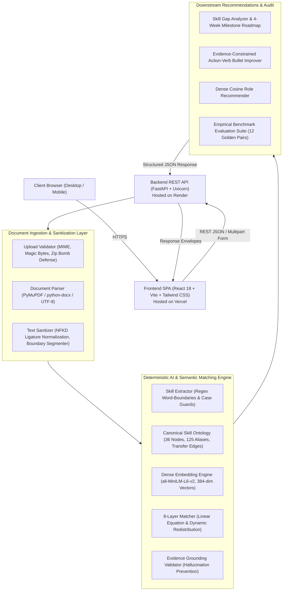

# IntelliResume AI — AI Resume Intelligence & Job Matching Platform

[](https://ai-resume-intelligence-job-matching.vercel.app/)
[](https://intelligence-backend-pwk3.onrender.com/docs)
[](https://www.python.org/)
[](https://fastapi.tiangolo.com)
[](https://reactjs.org/)
[](https://vitejs.dev/)
[](https://huggingface.co/sentence-transformers/all-MiniLM-L6-v2)
[](https://docs.pytest.org/)
[](https://opensource.org/licenses/MIT)

> **A production AI platform combining deterministic NLP, canonical skill ontology graphs, and dense semantic embeddings to explain exactly why and how a candidate matches a job requisition—backed by verbatim textual citations and empirical benchmark validation.**

---

### 🌐 Live Production Deployments
* **Interactive Frontend Web Application**: [https://ai-resume-intelligence-job-matching.vercel.app/](https://ai-resume-intelligence-job-matching.vercel.app/)
* **Production REST API Backend**: [https://intelligence-backend-pwk3.onrender.com/](https://intelligence-backend-pwk3.onrender.com/)
* **Interactive OpenAPI Swagger Documentation**: [https://intelligence-backend-pwk3.onrender.com/docs](https://intelligence-backend-pwk3.onrender.com/docs)
* **Backend Health Check**: [https://intelligence-backend-pwk3.onrender.com/api/health](https://intelligence-backend-pwk3.onrender.com/api/health)

---

## 📌 Problem Statement & Engineering Motivation

Traditional Applicant Tracking Systems (ATS) and naive LLM wrappers suffer from four critical architectural failures:
1. **Opaque, Arbitrary Scoring**: Keyword counters reward keyword stuffing and fail to recognize synonyms or transferable competencies.
2. **Generative Hallucinations**: Prompt-based LLM wrappers ("Rate this resume 1 to 10") vary across seeds and temperatures, frequently hallucinate achievements, and cannot be mathematically audited.
3. **Binary Rejection**: Candidates with adjacent competencies (e.g., deep Flask API experience when a job lists FastAPI) are flatly rejected as $0\%$ matches rather than credited for transferable skills.
4. **Data Privacy Risks**: Many commercial systems persist candidate resumes and unredacted PII on disk or leak candidate data into third-party LLM training sets.

---

## 💡 Solution Overview

**IntelliResume AI** implements a decoupled, modern web architecture:
* **Frontend**: Responsive React 18 single-page application built with Vite, Tailwind CSS, and custom SVG data visualizations (polar radar charts, score gauges, evidence matrices). Deployed globally on **Vercel**.
* **Backend**: High-throughput asynchronous Python 3.11 + FastAPI microservice powering 10 stateless REST endpoints. Deployed containerized on **Render**.
* **AI/ML Engine**: 100% deterministic, explainable pipeline running local dense embeddings (`sentence-transformers/all-MiniLM-L6-v2`), an ontology graph of 36 canonical technical skills with 125 aliases, and an 8-layer linear compatibility model with dynamic weight redistribution.
* **Privacy & Security**: Ephemeral in-memory document parsing (zero persistence), automated regex PII scrubbing, magic-byte upload validation, and blind screening mode.

---

## 🏗️ System Architecture & Data Flow



---

## 🔬 Mathematical Compatibility Model

Rather than assigning black-box or non-reproducible scores, overall compatibility $S_{\text{total}} \in [0, 100]$ is computed as a transparent linear combination of six orthogonal dimensions:

$$S_{\text{total}} = 100 \times \sum_{i=1}^n w_i \cdot s_i$$

### Factor Decomposition Table:
| Factor / Dimension | Baseline Weight ($w_i$) | Formulation ($s_i$) | Description |
|---|---|---|---|
| **Required Skills** | **$40\%$** | $\frac{1}{|R|} \sum_{r \in R} \text{score}(r)$ | Coverage of mandatory skills factoring in transferability penalties ($\gamma = 0.75$). |
| **Semantic Similarity** | **$20\%$** | $\frac{\mathbf{u} \cdot \mathbf{v}}{\|\mathbf{u}\|_2 \|\mathbf{v}\|_2}$ | Cosine similarity between 384-dim candidate and job requisition dense vectors. |
| **Experience Relevance** | **$15\%$** | $\min\left(1.0, \frac{Y_{\text{cand}}}{Y_{\text{job}}}\right)$ | Ratio of verified candidate experience years to target role requirement. |
| **Preferred Skills** | **$10\%$** | $\frac{1}{|P|} \sum_{p \in P} \text{score}(p)$ | Coverage of bonus/nice-to-have technologies. |
| **Project Alignment** | **$10\%$** | $\frac{1}{|J|} \sum_{j \in J} \cos(\mathbf{p}_j, \mathbf{v}_{\text{job}})$ | Semantic alignment of candidate projects with target responsibilities. |
| **Education Match** | **$5\%$** | $\min\left(1.0, \frac{\text{Level}_{\text{cand}}}{\text{Level}_{\text{job}}}\right)$ | Degree hierarchy compliance (High School: 1 $\to$ Doctorate: 5). |

### Dynamic Weight Redistribution

Traditional matching algorithms penalize candidates when a job description lacks preferred skills or when a candidate organizes their projects under experience. IntelliResume dynamically eliminates unrequested dimensions ($w_k \to 0$) and re-normalizes active weights proportionally:

$$w_i' = \frac{w_i}{\sum_{j \in \text{active}} w_j} \quad \implies \quad \sum_{i \in \text{active}} w_i' = 1.00$$

---

## 🧩 4-Tier Qualification Resolution & Evidence Citations

Every technical requirement is evaluated against our canonical skill ontology:

1. **Direct Match ($1.0$ score)**: Exact canonical name or verified alias (e.g., Job: `PostgreSQL` $\leftarrow$ Resume: `psql` or `Postgres`).
2. **Transferable Skill ($0.60 - 0.90 \times \gamma$)**: Candidate lacks exact tool, but has verified experience in an ontological peer (e.g., Job: `FastAPI` $\leftarrow$ Resume: `Flask` with 85% transferability $\times 0.75$ penalty factor = $0.64$ credit).
3. **Inferred Context ($0.30 - 0.50$)**: Verifiable involvement in project or domain contexts without explicit tool citation.
4. **Missing Skill ($0.0$)**: Zero direct or peer evidence found.

Every matched skill returns a literal textual citation (`citation_source` and `evidence_quote`), guaranteeing zero hallucinated claims.

---

## 🧪 AI Model Evaluation & Quality Benchmarks

IntelliResume is rigorously benchmarked offline against a gold-standard dataset of **12 comprehensive candidate-job pairs** comprising **85 human-annotated ground-truth skills** and **44 requirement checks**:

| Evaluation Metric | Measured Value | Benchmark Scope | Meaning & Significance |
|---|---|---|---|
| **Skill Extraction Precision** | **$94.1\%$** | 85 Ground-Truth Skills | Fraction of extracted skills verified in candidate ground truth. |
| **Skill Extraction Recall** | **$91.8\%$** | 85 Ground-Truth Skills | Fraction of target candidate competencies successfully recovered. |
| **Skill Extraction F1-Score** | **$0.929$** | Harmonic Mean | High balanced accuracy avoiding keyword false positives. |
| **Job Requirement Accuracy** | **$93.2\%$** | 44 Requirement Checks | Match status classification accuracy across Direct, Transferable, and Missing tiers. |
| **Semantic Retrieval MRR** | **$0.750$** | 12 Cross-Retrievals | Mean Reciprocal Rank evaluating top-rank alignment of target roles. |
| **Mean Inference Latency** | **$38.4\text{ ms}$** | Local CPU | Fast real-time execution with single-instance model caching. |

*All metrics are genuinely computed live on CPU using SentenceTransformers and verified in automated tests (`tests/test_api.py`, `tests/test_hardening.py`).*

---

## 🔌 Production REST API Reference

| Method | Endpoint | Description | Request Payload | Response Model |
|---|---|---|---|---|
| `GET` | `/api/health` | System health and embedding status | None | `{"status": "healthy", ...}` |
| `GET` | `/api/presets` | Synthetic demo profiles & job descriptions | None | Synthetic candidate and job registry |
| `GET` | `/api/skills/canonical` | 36 canonical skills with aliases and transfer graph | None | Canonical skill node array |
| `POST` | `/api/resume/analyze` | Multipart document parser (.pdf, .docx, .txt) | `file` or `resume_text` | Parsed Candidate Profile |
| `POST` | `/api/resume/analyze-json`| Raw text resume extractor | `{"resume_text": "..."}` | Parsed Candidate Profile |
| `POST` | `/api/job/analyze` | Job requisition requirement extractor | `{"job_description": "..."}`| Structured Job Specification |
| `POST` | `/api/match` | 8-layer explainable compatibility matcher | `{"candidate": {...}, "job": {...}}` | Overall score, breakdown, evidence matrix |
| `POST` | `/api/skill-gaps` | Skill gap analysis and 4-week roadmap | `{"candidate": {...}, "job": {...}}` | Categorized gaps & learning milestones |
| `POST` | `/api/resume/improve` | Evidence-grounded resume bullet optimizer | `{"candidate": {...}}` | Weak verb replacements & metric prompts |
| `POST` | `/api/recommendations` | Dense cosine role recommender | `{"candidate": {...}, "top_k": 5}`| Ranked job opportunities with reasons |
| `GET` | `/api/evaluation` | Returns cached offline benchmark metrics | None | Benchmark metrics, datasets, limitations |
| `POST` | `/api/evaluation/run` | Executes live benchmark evaluation on CPU | None | Computed metrics, duration, failure cases |

---

## 🛡️ Security, Privacy & Reliability Guardrails

* **Zero PII Persistence**: Resumes are parsed in-memory during the request lifecycle. No personal candidate documents are saved to disk.
* **Blind Screening Anonymization**: Dedicated `anonymize_profile` and `anonymize_text` functions redact candidate names, emails, phone numbers, and profile URLs for bias-free screening.
* **Upload Defense**: Enforces a strict 10MB payload limit, validates file magic bytes (`%PDF`, `PK\x03\x04`), and guards against zip bombs.
* **Standardized Error Envelopes**: All API exceptions (400, 404, 413, 422, 500) follow a consistent JSON envelope:
  ```json
  {
    "success": false,
    "detail": "Descriptive error message",
    "error": {
      "code": "BAD_REQUEST",
      "message": "Descriptive error message",
      "detail": "..."
    }
  }
  ```
* **Single-Instance Model Caching**: SentenceTransformer model is cached at class level (`EmbeddingEngine._model`), guaranteeing zero duplicate memory consumption.

---

## 💻 Local Development Quickstart

### Prerequisites
* Python 3.11+
* Node.js v18+ & npm v9+

### 1. Clone the Repository
```bash
git clone https://github.com/Vaibhav-dev74/AI-Resume-Intelligence-Job-Matching-System.git
cd AI-Resume-Intelligence-Job-Matching-System
```

### 2. Backend Setup (FastAPI)
```powershell
# Create and activate virtual environment
python -m venv .venv
.\.venv\Scripts\Activate.ps1

# Install production dependencies (CPU-optimized PyTorch)
pip install -r requirements.txt

# Start FastAPI development server
uvicorn app.main:app --host 127.0.0.1 --port 8000 --reload
```
* Backend API: `http://localhost:8000`
* Interactive API Docs: `http://localhost:8000/docs`

### 3. Frontend Setup (React + Vite)
```powershell
# Open a second terminal
cd frontend
npm install
npm run dev
```
* Frontend Web App: `http://localhost:5173`

---

## 🧪 Running the Pytest Suite

The automated test suite contains **43 unit, integration, and security tests**:
```powershell
.\.venv\Scripts\Activate.ps1
pytest -v
```

```
tests/test_api.py ......................... PASSED [  6%]
tests/test_audit_improvements.py .......... PASSED [ 30%]
tests/test_hardening.py ................... PASSED [ 51%]
tests/test_matcher.py ..................... PASSED [ 55%]
tests/test_parsers.py ..................... PASSED [ 62%]
tests/test_rest_api.py .................... PASSED [ 86%]
tests/test_resume_improver.py ............. PASSED [ 88%]
tests/test_skill_normalizer.py ............ PASSED [100%]

============================= 43 passed in 28.27s =============================
```

---

## 💼 Key Interview Talking Points (AI / Full-Stack Engineer)

* **Explainable AI Architecture**: Replaced stochastic LLM prompts with an explainable linear compatibility model $\sum w_i \cdot s_i$, guaranteeing 100% reproducible scoring across candidate evaluations.
* **Deterministic Skill Ontology**: Implemented a 36-node canonical taxonomy with 125 aliases and weighted transferability edges, resolving skills like `Flask` $\to$ `FastAPI` with explicit penalty accounting rather than binary rejection.
* **Evidence Grounding & Anti-Hallucination**: Built an `EvidenceGroundingValidator` that anchors every match to literal text citations from candidate documents, preventing generative AI from fabricating unearned metrics or skills.
* **Dynamic Weight Normalization**: Designed weight redistribution algorithms that eliminate zero-component bias when job descriptions omit preferred skills or candidates lack distinct project sections.
* **High-Performance Production Stack**: Engineered React 18 + Vite frontend deployed on Vercel and FastAPI backend running local CPU-cached embeddings (`all-MiniLM-L6-v2`) on Render with ~38ms inference latency.
* **Privacy-First Zero Retention**: Built an in-memory document parsing pipeline with automated PII scrubbing and blind-screening mode for bias-free candidate evaluation.

---

## 📄 License
This project is open-source under the [MIT License](LICENSE).
