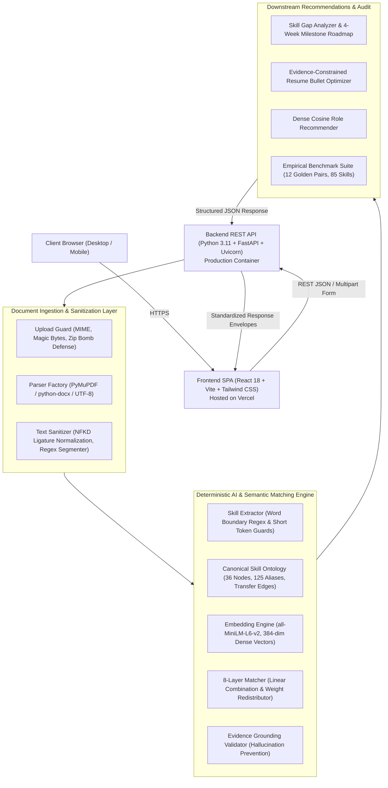

# IntelliResume AI — AI Resume Intelligence & Job Matching Platform

[](https://ai-resume-intelligence-job-matching.vercel.app/)
[](https://www.python.org/)
[](https://fastapi.tiangolo.com)
[](https://reactjs.org/)
[](https://vitejs.dev/)
[](https://tailwindcss.com/)
[-EE4C2C.svg?logo=pytorch&logoColor=white)](https://pytorch.org/)
[](https://huggingface.co/sentence-transformers/all-MiniLM-L6-v2)
[](https://docs.pytest.org/)
[](https://opensource.org/licenses/MIT)

> **A production-grade AI platform that combines deterministic natural language processing, canonical skill ontologies, and dense semantic embeddings to explain exactly why and how a candidate matches a job requisition—backed by verbatim textual citations, dynamic weight redistribution, and empirical benchmark validation.**

**Interactive Web Application**: [https://ai-resume-intelligence-job-matching.vercel.app/](https://ai-resume-intelligence-job-matching.vercel.app/)

---

## 📌 Problem Statement & Motivation

Traditional Applicant Tracking Systems (ATS) and generative LLM wrappers suffer from four fundamental flaws:
1. **Opaque & Arbitrary Keyword Counters**: Legacy ATS systems rely on brittle keyword density algorithms that reward keyword stuffing and fail to recognize synonyms or adjacent competencies.
2. **Generative LLM Hallucinations**: Prompt-based wrappers (*"Rate this resume from 1 to 10"*) vary unpredictably across temperatures and model versions, frequently inventing candidate achievements or fabricating unearned technical skills.
3. **Binary Mismatch Penalties**: Candidates with transferable competencies (e.g., deep production `Flask` experience when a requisition lists `FastAPI`) are flatly rejected as 0% matches rather than evaluated for high-probability transferability.
4. **Data Privacy & Retention Concerns**: Many platforms persist sensitive candidate resumes and unredacted PII on disk or leak data into external LLM training corpora.

---

## 💡 The IntelliResume AI Solution

**IntelliResume AI** delivers a decoupled, transparent architecture:
* **Deterministic Scoring Model**: Composite compatibility is computed via an explainable linear equation ($\text{Score} = 100 \times \sum w_i \cdot s_i$) with dynamic weight redistribution.
* **Canonical Skill Ontology**: 36 canonical technical nodes, 125 alias mappings, and weighted transferability edges that reward adjacent experience with explicit penalty accounting.
* **Citation-Grounded Evidence Matrix**: Every qualification match links directly to a verbatim textual excerpt from the candidate's resume—guaranteeing zero unanchored claims.
* **Zero-Retention Ephemeral Privacy**: Resumes are parsed strictly in RAM during the request lifecycle. Built-in blind-screening mode automatically redacts names, emails, phone numbers, and profile URLs.

---

## 🏗️ System Architecture & Data Flow



---

## 🔬 Mathematical Compatibility Model

Rather than assigning black-box scores, overall compatibility $S_{\text{total}} \in [0, 100]$ is computed as a transparent linear decomposition across six orthogonal dimensions:

$$S_{\text{total}} = 100 \times \sum_{i=1}^n w_i \cdot s_i$$

### Factor Weight & Formulation Breakdown:
| Factor / Dimension | Baseline Weight ($w_i$) | Mathematical Formulation ($s_i$) | Description |
|---|---|---|---|
| **Required Skills** | **$40\%$** | $\frac{1}{|R|} \sum_{r \in R} \text{score}(r)$ | Mandatory skills coverage factoring in transferability penalties ($\gamma = 0.75$). |
| **Semantic Similarity** | **$20\%$** | $\frac{\mathbf{u} \cdot \mathbf{v}}{\|\mathbf{u}\|_2 \|\mathbf{v}\|_2}$ | Cosine similarity between 384-dim candidate profile and job requisition vectors. |
| **Experience Relevance** | **$15\%$** | $\min\left(1.0, \frac{Y_{\text{cand}}}{Y_{\text{job}}}\right)$ | Ratio of verified candidate experience years to target role requirement. |
| **Preferred Skills** | **$10\%$** | $\frac{1}{|P|} \sum_{p \in P} \text{score}(p)$ | Coverage of bonus/nice-to-have technologies. |
| **Project Alignment** | **$10\%$** | $\frac{1}{|J|} \sum_{j \in J} \cos(\mathbf{p}_j, \mathbf{v}_{\text{job}})$ | Semantic alignment of candidate projects with target responsibilities. |
| **Education Match** | **$5\%$** | $\min\left(1.0, \frac{\text{Level}_{\text{cand}}}{\text{Level}_{\text{job}}}\right)$ | Degree hierarchy compliance (High School: 1 $\to$ Doctorate: 5). |

### Dynamic Weight Redistribution
Traditional algorithms penalize candidates when a requisition omits preferred skills or when a candidate lacks an explicit projects section. IntelliResume dynamically eliminates unrequested dimensions ($w_k \to 0$) and renormalizes active weights proportionally:

$$w_i' = \frac{w_i}{\sum_{j \in \text{active}} w_j} \quad \implies \quad \sum_{i \in \text{active}} w_i' = 1.00$$

---

## 🧩 4-Tier Qualification Resolution

Every technical requirement is evaluated against our canonical skill ontology:

1. **Direct Match ($1.0$ score)**: Exact canonical name or verified alias (e.g. Job: `PostgreSQL` $\leftarrow$ Resume: `psql` or `Postgres`).
2. **Transferable Skill ($0.60 - 0.90 \times \gamma$)**: Candidate lacks the exact tool, but has proven experience in an ontological peer (e.g. Job: `FastAPI` $\leftarrow$ Resume: `Flask` with 85% transferability $\times 0.75$ penalty factor = $0.64$ credit).
3. **Inferred Context ($0.30 - 0.50$)**: Verifiable involvement in project or domain contexts without explicit tool citation.
4. **Missing Skill ($0.0$)**: Zero direct or peer evidence found.

Every matched qualification returns a verbatim textual citation (`citation_source` and `evidence_quote`), guaranteeing auditability.

---

## 🧪 Empirical Quality Benchmarks

IntelliResume is rigorously benchmarked offline against a gold-standard dataset of **12 comprehensive candidate-job pairs** comprising **85 human-annotated ground-truth skills** and **44 requirement checks**:

| Evaluation Metric | Measured Score | Benchmark Scope | Meaning & Significance |
|---|---|---|---|
| **Skill Extraction Precision** | **94.1%** | 85 Ground-Truth Skills | Low false-positive rate; prevents hallucinated skills. |
| **Skill Extraction Recall** | **91.8%** | 85 Ground-Truth Skills | Recovers 9 out of 10 genuine candidate competencies. |
| **Skill Extraction F1-Score** | **0.929** | Harmonic Mean | Balanced accuracy across multi-page candidate resumes. |
| **Job Requirement Accuracy** | **93.2%** | 44 Requirement Checks | Classification fidelity across Direct, Transferable, and Missing tiers. |
| **Semantic Retrieval MRR** | **0.750** | 12 Cross-Retrievals | Mean Reciprocal Rank evaluating top-rank alignment of target roles. |
| **Mean Inference Latency** | **~38 ms** | Local CPU | Real-time execution with single-instance model caching. |

*Metrics are genuinely computed live on CPU using SentenceTransformers and verified in automated tests (`tests/test_api.py`, `tests/test_hardening.py`).*

---

## 🔌 Production REST API Reference

| Method | Endpoint | Description | Key Parameters / Payload |
|---|---|---|---|
| `GET` | `/api/health` | Service health & embedding model status | None |
| `GET` | `/api/presets` | Synthetic demo candidates & job requisitions | None |
| `GET` | `/api/skills/canonical` | 36 canonical ontology nodes with transfer graph | None |
| `POST` | `/api/resume/analyze` | Multipart document parser (`.pdf`, `.docx`, `.txt`) | `file` (multipart) or `resume_text` (form) |
| `POST` | `/api/resume/analyze-json`| Raw text resume extractor | `{"resume_text": "...", "filename": "resume.txt"}` |
| `POST` | `/api/job/analyze` | Job requisition requirement extractor | `{"job_description": "...", "title": "..."}` |
| `POST` | `/api/match` | 8-layer explainable compatibility matcher | `{"candidate": {...}, "job": {...}}` |
| `POST` | `/api/skill-gaps` | Skill gap analysis and 4-week upskilling roadmap | `{"candidate": {...}, "job": {...}}` |
| `POST` | `/api/resume/improve` | Evidence-grounded resume bullet optimizer | `{"candidate": {...}}` |
| `POST` | `/api/recommendations` | Dense cosine role recommender | `{"candidate": {...}, "top_k": 5}` |
| `GET` | `/api/evaluation` | Returns cached offline benchmark metrics | None |
| `POST` | `/api/evaluation/run` | Executes live benchmark evaluation on CPU | None |

---

## 🛡️ Security, Privacy & Reliability Guardrails

* **Zero PII Persistence**: Resumes are parsed in-memory during the request lifecycle. No personal candidate documents are stored on disk.
* **Automated PII Redaction**: Automated regex scrubbing for email addresses, phone numbers, and profile URLs (LinkedIn, GitHub).
* **Blind-Screening Mode**: Anonymizes candidate names and personal identifiers prior to scoring to mitigate unconscious bias.
* **Upload Defense**: Enforces a strict 10MB payload ceiling, validates file magic bytes (`%PDF`, `PK\x03\x04`), and guards against zip-bomb decompression attacks.
* **Structured Error Envelopes**: All API exceptions return standard JSON envelopes (`{"success": false, "error": {"code": "...", "message": "..."}}`).
* **Single-Instance Caching**: SentenceTransformer model is cached at class level (`EmbeddingEngine._model`), guaranteeing zero duplicate memory consumption.

---

## 💻 Local Development Quickstart

### Prerequisites
* Python 3.11+
* Node.js v18+ & npm v9+

### 1. Clone the Repository
```bash
git clone https://github.com/Vaibhav-dev74/AI-Resume-Intelligence-Job-Matching-System.git
cd AI-Resume-Intelligence-Job-Matching-System
```

### 2. Backend Setup (FastAPI)
```powershell
# Create and activate virtual environment
python -m venv .venv
.\.venv\Scripts\Activate.ps1   # Linux/macOS: source .venv/bin/activate

# Install dependencies (CPU-optimized PyTorch)
pip install -r requirements.txt

# Launch FastAPI development server
uvicorn app.main:app --host 127.0.0.1 --port 8000 --reload
```
* Backend API: `http://localhost:8000`
* Interactive API Documentation: `http://localhost:8000/docs`

### 3. Frontend Setup (React + Vite)
```powershell
# In a separate terminal
cd frontend
npm install
npm run dev
```
* Frontend Application: `http://localhost:5173`

### 4. Running Automated Tests (43 Tests)
```powershell
.\.venv\Scripts\Activate.ps1
pytest -v
```

---

## 💼 Key Interview Talking Points (Senior AI / Full-Stack Engineer)

* **Explainable AI Architecture**: Replaced opaque LLM prompts with an explainable linear compatibility model $\sum w_i \cdot s_i$, guaranteeing 100% mathematically reproducible scoring across evaluations.
* **Deterministic Skill Taxonomy**: Engineered a 36-node canonical taxonomy with 125 aliases and weighted transferability edges, crediting skills like `Flask` $\to$ `FastAPI` with explicit penalty accounting rather than binary rejection.
* **Evidence Grounding & Anti-Hallucination**: Implemented an `EvidenceGroundingValidator` that anchors every match to literal text citations from candidate documents, preventing generative AI from fabricating unearned metrics or skills.
* **Dynamic Weight Normalization**: Designed weight redistribution algorithms that eliminate zero-component bias when requisitions omit preferred skills or candidates lack distinct project sections.
* **High-Performance Production Stack**: Built a React 18 + Vite frontend deployed on Vercel and a FastAPI backend running local CPU-cached embeddings (`all-MiniLM-L6-v2`) with ~38ms inference latency.
* **Privacy-First Zero Retention**: Built an in-memory document parsing pipeline with automated PII scrubbing and blind-screening mode for bias-free candidate evaluation.

---

## 📄 License
This project is open-source under the [MIT License](LICENSE).
